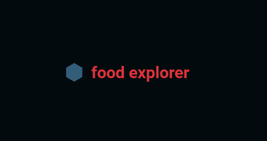
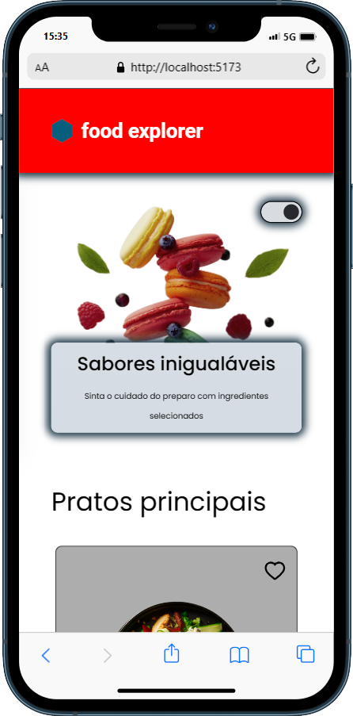

<p align="center">
      <h1> Food Explorer - Elizândra Monteiro </h1>
</p>

<p align="center">
  
</p>

Este é o resultado do desafio final do Explorer, o Food Explorer.
<br>
Nele realizei a criação do FrontEnd e do BackEnd completo da aplicação.

___

## 💻 Sobre
Food Explorer é uma aplicação web de restaurante, cujo os recursos Principais são:

- Cadastro de Usuário:

Os usuários podem se cadastrar na plataforma.
- Criação de Pedidos:

Os usuários cadastrados podem criar pedidos de comida.
- Acompanhamento de Status:

Os usuários podem acompanhar o status de seus pedidos em tempo real.
- Customização de Perfil:

Os usuários podem personalizar seus perfis, incluindo avatar, nome e senha.
- Filtragem de Favoritos:

Os usuários podem filtrar seus pratos favoritos.
- Campo de Busca:

Existe um campo de busca para facilitar a localização de pratos específicos.
- Contato com o Restaurante:

Os usuários podem entrar em contato com o restaurante por meio de uma seção dedicada.
- Carrinho Funcional:

O carrinho de compras está totalmente funcional para adicionar/remover itens.
- Formas de Pagamento:

Os usuários podem escolher entre duas formas de pagamento: cartão de crédito ou Pix.
- Administração de Pratos:

Os administradores têm a capacidade de criar, editar e remover pratos da plataforma.
- Gerenciamento de Status de Pedidos:

Os administradores podem atualizar o status dos pedidos de acordo com o processo de preparo na cozinha.
- Atualização em Tempo Real:

O status dos pedidos é imediatamente atualizado na tela dos consumidores.
- Mudança de Tema:

Os usuários podem personalizar o tema da página de acordo com suas preferências.
- Efeitos Visuais:

A aplicação possui diversos efeitos visuais para melhorar a experiência do usuário.
- Responsividade:

A aplicação é responsiva, funcionando bem em vários tipos de dispositivos.
- Tecnologias Utilizadas:

- Frontend desenvolvido em React.js.
- Backend construído em Node.js.

O Food Explorer oferece uma experiência completa de pedido de comida, desde o registro e customização de perfil até o acompanhamento dos pedidos em tempo real, tudo com uma interface amigável e responsiva. Além disso, os administradores têm controle total sobre os pratos e o status dos pedidos.
___

## 🎨 Layout
A página inicial em formato desktop é vista na imagem abaixo:


E assim no formato Mobile:



___

## 🛠 Tecnologias

As seguintes tecnologias foram empregadas na criação deste projeto:

- [ReactJs](https://reactjs.org)
- [Node.js](https://nodejs.org/en/)
- [Javascript](https://developer.mozilla.org/pt-BR/docs/Web/JavaScript)
- [Vite](https://vitejs.dev/)
- [Express](https://expressjs.com)
- [Nodemon](https://nodemon.io/)
- [SQLite](https://www.sqlite.org/index.html)
- [Knex](https://knexjs.org/)
- [BCryptjs](https://www.npmjs.com/package/bcryptjs)
- [JSON Web Token](https://www.npmjs.com/package/jsonwebtoken)
- [Multer](https://www.npmjs.com/package/multer)
- [CORS](https://www.npmjs.com/package/cors)
- [Axios](https://www.npmjs.com/package/axios)
- [Styled Components](https://styled-components.com/)
- [React Icons](https://react-icons.github.io/react-icons/)
- [Swiper](https://swiperjs.com/)
- [React Router Dom](https://react-icons.github.io/react-icons/)

___

## 🚀 Como utilizar

Clone o projeto para o local desejado em seu computador.

```bash
$ git clone git@github.com:ElizandraMonteiro/Food-Explorer-Frontend
```
___

#### 🚧 Executando o BackEnd
```bash
# No BackEnd insira uma porta e um secret no arquivo .env vazio
  AUTH_SECRET=
  PORT=

# Navegue até o diretório do BackEnd
$ cd food-explorer-backend

# Instale as dependências necessárias
$ npm install

# Agora inicie o servidor do BackEnd
$ npm run dev
```
___

#### 💻 Executando o FrontEnd
```bash
# Navegue até o diretório do FrontEnd
$ cd food-explorer-frontend

# Instale as dependências necessárias
$ npm install

# Agora inicie o servidor do FrontEnd
$ npm run dev

# O terminal irá exibir o endereço local onde a aplicação está sendo executada. Basta digitar o mesmo endereço em seu navegador preferido. O endereço usado na criação do projeto foi este:

  http://localhost:5173/
```

#### 🔑 Quer ver como a aplicação funciona vista pelo Admin? Use a conta a seguir:

```bash
  e-mail: admin@foodexplorer.com
  senha: 123456
```
___

Este BackEnd foi hospedado diretamente no Render.
Já o Frontend foi hospedado diretamente no Netlify.

___
⚠️ **Importante**: Este projeto está utilizando uma hospedagem gratuita para o seu backend, portanto, pode haver atrasos no tempo de resposta do servidor. 

[O resultado FINAL pode ser visto aqui](https://food-explorer-em.netlify.app/)
